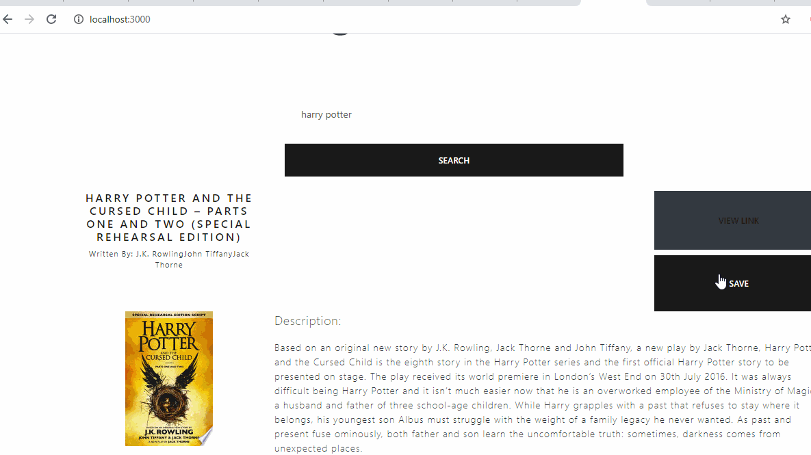

# google_books
Search Books with this Useful App

# About 

This application is a tool to quickly look up book and save them for future reading. 

# Link to Repo 
* [Git hub Repo](https://github.com/lmd808/google_books)

# Link to Deployed
* [Heroku App](https://https://googlebooksearch156.herokuapp.com/)

# Technologies 
nodeJS, Javascript, BootStrap, BootSwatch, Reactjs GoogleBooks API, MongoDB, mongoose 

# Demos 

;
;
;

# Difficulties 
The most difficult part of this development process was visualizing what state is. I worked through this project with a couple of my friends and we more of less helped each other reach the finish line.

Building this application helped me understand ReactJS in a much deeper fashion- however. I would not touch this code again unless paid for it. The functionality my not be the best, but bootSwatch can make anything look nice. 

# Creator 
Laura DiTommaso
